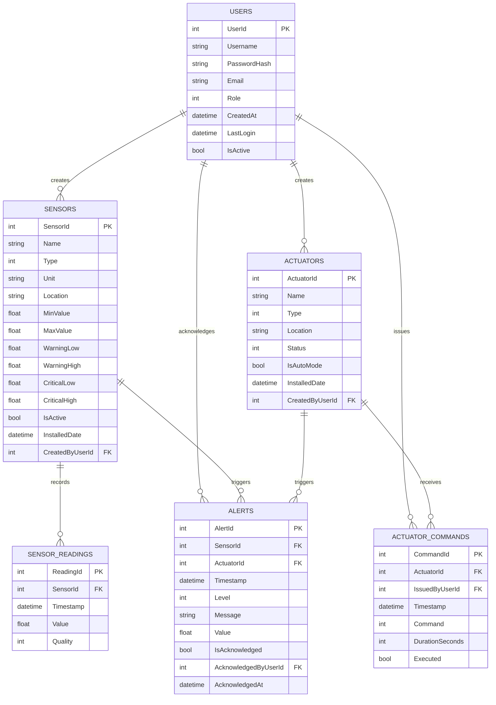

# Diagrama ER

```mermaid
erDiagram
    USERS ||--o{ SENSORS : creates
    USERS ||--o{ ACTUATORS : creates
    USERS ||--o{ ACTUATOR_COMMANDS : issues
    USERS ||--o{ ALERTS : acknowledges
    SENSORS ||--o{ SENSOR_READINGS : records
    SENSORS ||--o{ ALERTS : triggers
    ACTUATORS ||--o{ ACTUATOR_COMMANDS : receives
    ACTUATORS ||--o{ ALERTS : triggers

    USERS {
        int UserId PK
        string Username
        string PasswordHash
        string Email
        int Role
        datetime CreatedAt
        datetime LastLogin
        bool IsActive
    }

    SENSORS {
        int SensorId PK
        string Name
        int Type
        string Unit
        string Location
        float MinValue
        float MaxValue
        float WarningLow
        float WarningHigh
        float CriticalLow
        float CriticalHigh
        bool IsActive
        datetime InstalledDate
        int CreatedByUserId FK
    }

    SENSOR_READINGS {
        int ReadingId PK
        int SensorId FK
        datetime Timestamp
        float Value
        int Quality
    }

    ACTUATORS {
        int ActuatorId PK
        string Name
        int Type
        string Location
        int Status
        bool IsAutoMode
        datetime InstalledDate
        int CreatedByUserId FK
    }

    ACTUATOR_COMMANDS {
        int CommandId PK
        int ActuatorId FK
        int IssuedByUserId FK
        datetime Timestamp
        int Command
        int DurationSeconds
        bool Executed
    }

    ALERTS {
        int AlertId PK
        int SensorId FK
        int ActuatorId FK
        datetime Timestamp
        int Level
        string Message
        float Value
        bool IsAcknowledged
        int AcknowledgedByUserId FK
        datetime AcknowledgedAt
    }
```
